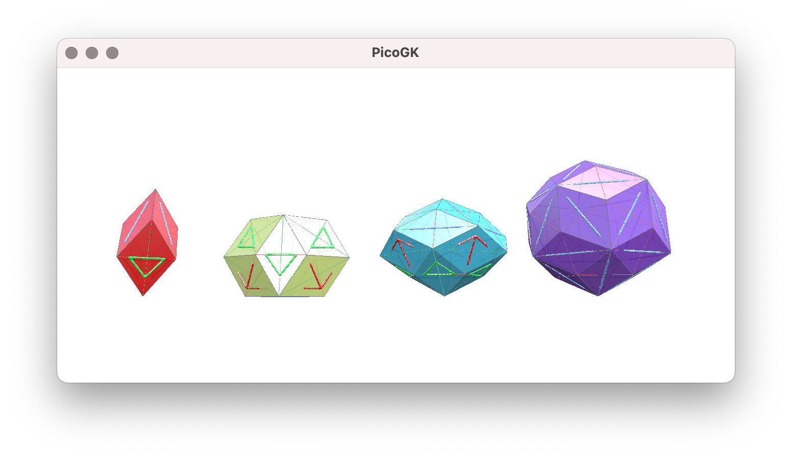
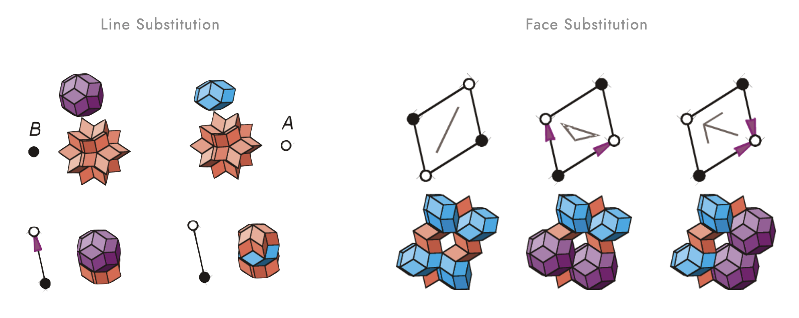
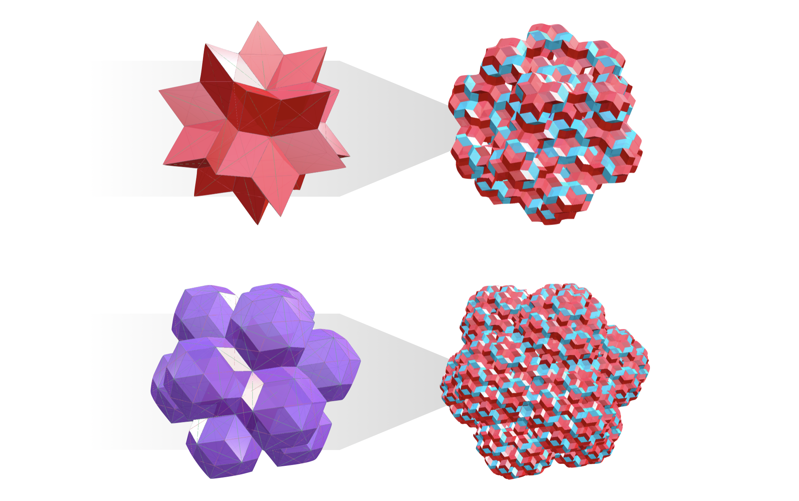

# Quasi Crystals and Penrose Patterns

### Prep

This library provides a starting point to generating aperiodic tilings such as Penrose Patterns in 2D and Quasi Crystals in 3D. In Generative Design, we are acustomed to lattices, by which we typically mean periodically repeating units with constant intervals. And the same holds true for regular crystalline matter. However, aperiodicity became popular through the discovery of quasi-ordered structures ("quasi-crystals") both in theory and in practice and the interesting material properties such new kind of matter can hold. We proposed aperiodic tilings for engineering applications before, especially those that tend to suffer from vibrational-structural coupling. [Here is an example of where we applied a multi-layered Penrose Pattern to an airframe panel for hypersonic flight](https://leap71.com/2023/03/24/penrose-tiles-for-hypersonics/). We theorize that a pattern with no translational symmetry and non-repeating units should be more resilient to a wide range of frequencies, exhibiting no distinct resonance effect. 

At the same time, quasi-crystals and the likes are impossible to construct manually and have not seen much practical application despite their promise. We are publishing this library to provide a solid starting point, hoping that we will see engineering applications in the future. 

In order to run the code, you need the [PicoGK](https://github.com/leap71/PicoGK) geometry engine and the [ShapeKernel](https://github.com/leap71/LEAP71_ShapeKernel) library. 


### Getting Started

Let's start by adding our source code into youe project. Pick one of the two options below.

- Beginner
  - download the QuasiCrystal source code as zip file from https://github.com/leap71/LEAP71_QuasiCrystals
  - un-zip and copy the files into your Visual Studio project folder
- Pro
  - add QuasiCrystal library as a submodule, linking the Github repo: https://github.com/leap71/LEAP71_QuasiCrystals

Your `Program.cs` should look like this and we start off by using the  `PenrosePatternShowCase.Task`: 

```c#
using Leap71.QuasiCrystalExamples;

try
{
    PicoGK.Library.Go(
        0.4f,
        PenrosePatternShowCase.Task);
}
catch (Exception e)
{
    Console.WriteLine("Failed to run Task.");
    Console.WriteLine(e.ToString());
}
```


### Penrose Pattern

Running the task function `PenrosePatternShowCase.Task` will generate a 2D Penrose Pattern consisting of "fat" and "skinny" rhombic tiles. If you choose higher numbers of iterations for `nGenerations`, the pattern will become more intricate as illustrated below.


There was a time in material science when it was believed that the atoms and molecules within matter can either be in a perfectly ordered structure (crystals) or completely random arrangements (amorphous, glass). The Penrose Pattern started off as a mathematical curiosity, but soon influenced physicists to look for / expect a 3D equivalent in matter. What is special about this pattern? The Penrose Pattern tiles the plane indefinitely without being periodic, meaning you can translate it back and forth in any direction and it will never match itself again. The Penrose Pattern exhibits clusters of ordered five-fold symmetry (which is known to be "forbidden" in any kind of periodic tiling).  So, whilst not being periodic, it is not totally random either. This property was called a-periodicity.

Aperiodicity is somewhat harder to construct from scratch, since you can only set one tile to another by trial-and-error (respecting certain matching rules). You might end up with a configuration where no new tile can be added and therefore you will need to go back a few steps and try something else. In a periodic crystal / regular lattice you can simply add one tile at a time in the same manner and it will go on forever. The method we are using here for constructing aperiodic tiling is not trial-and-error, but a subdivision process where each "generation" of tiles is "inflated" into more, smaller tiles that make up the next generation. The image below from this [paper](https://www.researchgate.net/publication/343969683_Penrose_tiling_for_visual_secret_sharing) illustrates the inflation rules that we are using for the Penrose Pattern. Such a hierachical logic will always produce correct tilings, but it is heavily linked and limited to the initial condition from which the subdivision process starts. Only certain tilings can be generated this way.


### Quasi Crystals

Next, run `QuasiCrystalShowCase.IntroduceQuasiTilesTask` to generate and visualize the elementary tiles for a quasi-crystal. As mentioned before, the Penrose Pattern has two elementary tiles (fat and skinny rhombus) and a set of matching rules that dictate how any pair of tiles can be connected. This enforces the five-fold symmetry and prevents scenarios where rhomic tiles can be placed periodically. Quasi-crystals are very similar to that. Only, the 3D case has four elementary tiles that are all constructed from the same rhombic faces. In our code, these tiles are called `QuasiTile_01`, `QuasiTile_02`, `QuasiTile_03` and `QuasiTile_04` and are shown in the image below in the same sequence:



Note that this task function includes a line of code where the tiles are previewed. There are different options for this visualization. If you choose `EPreviewFace.CONNECTOR`, a blue line, a green triangle or a red arrow will be displayed on each face indicating the connector type. When constructing / inflating an icosahedral quasi-crystal, only faces of same type can be connected. The `LINE` type has two possible orientations, while the `ARROW` or `TRIANGLE` on both faces have to point in the same direction. These are the matching rules that enforce the quasi-tiles to connect aperiodically. While this preview method is useful for debugging small tilings, it will significantly slow down the display of larger quasi-crystals. In such a case you want to choose `EPreviewFace.AXIS` for only showing the long and short axis of each face or even `EPreviewFace.NONE` for no face-specific decoration. The image below shows the difference between these preview methods.

```c#
//show each face with connector type, long and short axis and face boundary
oTile_01.Preview(QuasiTile.EPreviewFace.CONNECTOR);

//show each face with long and short axis and face boundary
oTile_01.Preview(QuasiTile.EPreviewFace.AXIS);

//no face-specific preview
oTile_01.Preview(QuasiTile.EPreviewFace.NONE);
```


Now that we know about the four elementary quasi-tiles, we can use the inflation / substitution rules for individual lines within a rhombic face from this [paper](https://www.semanticscholar.org/paper/Substitution-rules-for-icosahedral-quasicrystals-Madison/5ffbb7614e3311fe17814d62902c1e643bcbe52e) to subdivide and construct more complex tile arrangements. If you didn't take the different preview options seriously before, your will find here that each subdivision turns one face into approximately 120 new faces. So, the number of faces grow by $120^{x}$  or a factor of 120 per iteration!



Run `QuasiCrystalShowCase.CrystalFromFaceTask` to inflate a single rhombic face (called`IcosahedralFace`) by one or two generations in the same manner. See how many generations up you can go!


Since each quasi-tile is made up of multiple such rhombic faces, the same inflation can be applied to a full quasi-tile or even a list of preset quasi-tiles. The aforementioned paper gives examples for each quasi-tile:


Run `QuasiCrystalShowCase.CrystalFromTileTask` to inflate tiles in the same manner. You can select from the following lines of code to either inflate a single tile or choose one of the two preset lists as initial condition. The following images show you some of the generational sequences and the "largest breeds" that you can explore this way.

```c#
//elementary quasi-tile between 1 and 4 as a single list item
QuasiTile oInitialTile          = new QuasiTile_04(new LocalFrame(), 50);
List<QuasiTile> aInitialTiles   = new List<QuasiTile>() { oInitialTile };

//preset, hard-coded list of quasi-tiles (option 1)
List<QuasiTile> aInitialTiles   = QuasiCrystal.aGetFirstGenerationTiles();

//preset, hard-coded list of quasi-tiles (option 2)
List<QuasiTile> aInitialTiles   = QuasiCrystal.aGetSecondGenerationTiles();
```




As a last step, we will turn such a quasi-crystal that we have previewed before as colored mesh faces into a wireframe of lattice beams and voxelize it. Run `QuasiCrystalShowCase.WireframeFromCrystalTask` to generate `Voxels voxCrystalWireframe`. As a voxelfield, the resulting shape can now be used for subsequent offsetting and boolean operations.


### Sources

- https://en.wikipedia.org/wiki/Penrose_tiling
- https://thinkzone.wlonk.com/Quasicrystals/QCBlocks-CutFold.html
- https://thinkzone.wlonk.com/Quasicrystals/QCBlocks-CutFoldInstructions.pdf
- Paper: "Substitution rules for icosahedral quasicrystals" by Alexey E. Madison
- Book: "The Second Kind of Impossible" by Paul J. Steinhardt